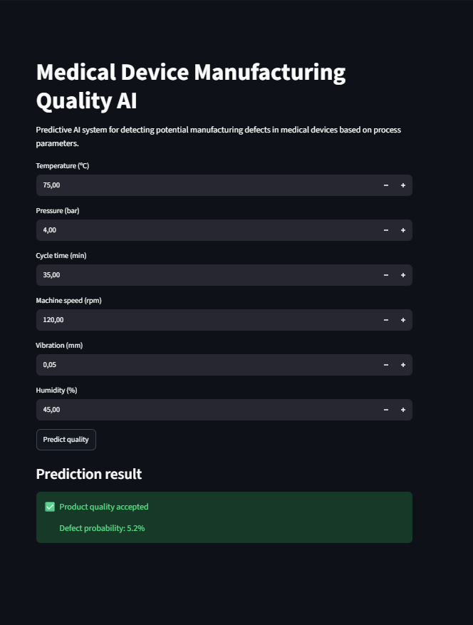

# AI-Based Medical Device Manufacturing Defect Prediction

## Overview

This project develops an Artificial Intelligence system for predicting potential manufacturing defects in medical devices using machine learning techniques.

The objective is to simulate an Industry 4.0 quality control scenario where manufacturing parameters are analyzed to identify products with increased defect risk before final inspection.

The project combines:
- Data generation
- Exploratory Data Analysis
- Machine Learning classification
- Model evaluation
- Explainable AI techniques
- Interactive prediction dashboard

---

# Project Objectives

The main goals of this project are:

- Develop a predictive quality model for medical device manufacturing.
- Identify critical process parameters influencing defects.
- Compare different machine learning algorithms.
- Optimize the model for defect detection.
- Build an interactive application for real-time quality prediction.

---

# Dataset

A synthetic manufacturing dataset was generated to simulate a medical device production process.

The dataset contains:

| Parameter | Description |
|---|---|
| temperature_C | Manufacturing temperature |
| pressure_bar | Process pressure |
| cycle_time_min | Production cycle duration |
| machine_speed_rpm | Machine operating speed |
| vibration_mm | Mechanical vibration level |
| humidity_percent | Environmental humidity |
| defect | Quality label (0 = OK, 1 = Defect) |

---

# Methodology

## 1. Data Generation and Analysis

A synthetic dataset was created representing manufacturing variability.

Exploratory analysis included:

- Statistical analysis
- Feature correlation
- Identification of relevant manufacturing parameters

## 2. Machine Learning Models

Three classification algorithms were evaluated:

### Logistic Regression

Used as a baseline model.

### Random Forest

Selected as the final model due to its balance between defect detection capability and overall performance.

### Gradient Boosting

Evaluated as an advanced boosting approach.

---

# Model Evaluation

The main challenge of the project was detecting defective devices in an imbalanced dataset.

Accuracy alone was not considered sufficient because missing a defective medical device is more critical than generating additional inspections.

The main evaluation metric was:

**Recall of defective products**

---

# Results

Final Random Forest model:

| Metric | Result |
|---|---:|
| Accuracy | 79% |
| Defect Recall | 54% |
| Defect F1-score | 0.43 |

The model was optimized through:

- Class imbalance handling
- Threshold adjustment
- Model comparison

---

# Feature Importance

The most influential manufacturing parameters identified by the model were:

| Rank | Feature |
|---|---|
| 1 | Cycle time |
| 2 | Temperature |
| 3 | Vibration |
| 4 | Pressure |
| 5 | Humidity |
| 6 | Machine speed |

These results provide insights into which process variables have the highest impact on manufacturing quality.

---

# Application Demo

A Streamlit application was developed to demonstrate real-time defect prediction.

The user can introduce manufacturing parameters and obtain:

- Defect probability
- Quality prediction
- Risk assessment

Workflow:

Manufacturing parameters  
↓  
Machine Learning Model  
↓  
Defect Probability  
↓  
Quality Decision

---

# Technologies Used

Programming:
- Python

Libraries:
- Pandas
- NumPy
- Scikit-learn
- Matplotlib
- Seaborn
- Streamlit
- Joblib

Tools:
- Visual Studio Code
- Jupyter Notebook
- GitHub

---

# Project Structure

ML-Medical-Device-Quality-AI

├── app
│ └── app.py
│
├── data
│ └── manufacturing_data.csv
│
├── models
│ └── medical_device_quality_AI.pkl
│
├── notebooks
│ ├── 01_generate_dataset.ipynb
│ └── 02_machine_learning.ipynb
│
├── results
│ ├── confusion_matrix.png
│ ├── feature_importance.png
│ └── model_comparison.csv
│
└── README.md

---

# Future Improvements

Possible extensions:

- Integration with real manufacturing datasets.
- Deep learning approaches.
- Sensor data streaming.
- Automated quality monitoring dashboard.
- Model explainability using SHAP.
- Deployment in cloud environments.

---

# Author

Marcos Almansa Palomares Biomedical Engineering Student at Universitat Politècnica de València 

Interested in:
- Medical Devices
- Artificial Intelligence
- Predictive Quality
- Industry 4.0
